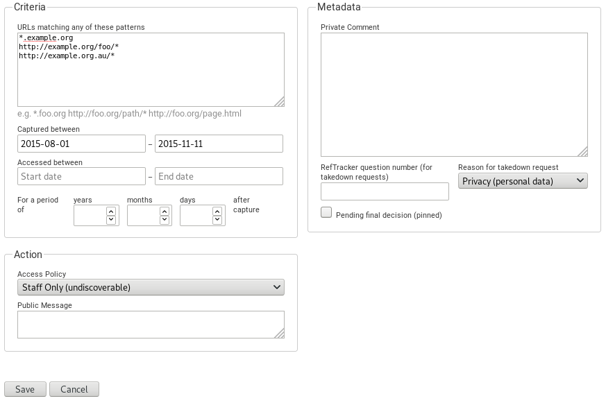

# Access Control

OutbackCDX's access control is built on three concept: access point, policies and rules.

Access points represent locations (on-site vs off-site), groups of users (e.g. staff, students, researchers),
or ways the content is reused (full text indexing). OutbackCDX itself attempt to map usernames or IP addresses or 
usernames to access points it leaves that up to the client. For example a client making querying collection `mycoll` 
for `example.org` via the `staff` access point might would use: `/mycoll/ap/staff?url=http://example.org/`

Access policies define sets of access points which can be referenced in rules. For example:

| Policy ID | Policy Name   | Access points |
|-|-------------------------|---------------|
|1| Public (searchable)     | on-site, off-site, staff, solr |
|2| Public (not searchable) | on-site, off-site, staff |
|3| On-site only            | on-site, staff |
|4| Staff only              | staff |


# Rules

OutbackCDX access control rules are JSON objects containing three types of fields: criteria, actions and metadata.



```json
{
  "id": 819,
  "policyId": 4,
  "urlPatterns": [
    "*.example.org",
    "http://example.org/foo/*",
    "http://example.org.au/*"
  ],
  "captured": {
    "start": "2015-08-01T01:00:00+1000",
    "end": "2015-11-12T01:59:59+1100"
  },
  "accessed": {
    "start": "2019-11-04T02:00:00+1100",
    "end": "2019-11-07T01:59:59+1100"
  },
  "period": {
    "years": 0,
    "months": 1,
    "days": 0
  },
  "publicMessage": "pub comment",
  "pinned": false,
  "privateComment": "priv commentd",
  "reason": "Privacy (personal data)",
  "created": "2019-11-13T23:09:56+1100",
  "creator": "anonymous",
  "modified": "2019-11-13T23:45:56+1100",
  "modifier": "anonymous"
}
```

## Criteria fields

The rule applies to captured resources which match ALL of the present (non-null) criteria fields.

### URL patterns

Selects resources matching one or more URL patterns. Patterns support the same wildcards as the ?url= field in a CDX query.

The wildcard syntax is used merely for human convenience. Matching is internally implemented by converting them to
equivalent SURT prefix.

```
"urlPatterns": [
  "*.example.org",
  "http://example.org/*",
  "https://example.org/bad.html"]
```

### Captured between {start} and {end}

Matches resources captured during a given time range. If the start or end of the range is null the rule matches
all captures after or before that time respectively. If both start and end are null, or the captured field is 
missing the rule matches resourced captured at any time.

```
  "captured": {
    "start": "2015-08-01T01:00:00+1000",
    "end": "2015-11-12T01:59:59+1100"
  },
```

Example use case: A page contained restricted content only for a period of time. We still want to allow access
to versions captured outside that time period.

### Accessed between {start} and {end}

Applies this rule only when the current time at moment of access is within the given range.

If the start or end of the range is null the rule matches all moments after or before that time respectively. If
both start and end are null, or the `accessed` field is missing the rule matches at all moments.

```
"accessed": {
    "start": "2019-11-04T02:00:00+1100",
    "end": "2019-11-07T01:59:59+1100"
},
```

Example use case: To apply a restriction which only applies temporarily after which the rule expires. Perhaps while a
takedown request is being reviewed or as ordered by a court.

### Embargo period: for {years}, {months}, {days} after capture

Applies this rule to resources for a given number of years, months and days after capture. i.e. this criteria
applies to records matching the expression `WARC-Date > now - period`.

If any of the days/months/years subfields are missing they default to zero.

```
"period": {
   "years": 0
   "months": 6,
   "days": 0,
}
```

Example use case: To ensure only older versions of resources can be accessed so as not compete with the live site for
access to current content.


## Action fields

Action fields specify the effect the rule has on matching resources.

### Access Policy

Specifies the id of the access policy this rule applies. See the introduction text above for an explanation of policies.

```
"policyId": 4

```

### Public Message

An explanatory message shown when this rule prevents access.

```
"publicMessage": "This page is inaccessible for privacy reasons.",
```

## Metadata fields

Metadata fields have no functional effect but contain additional information for record keeping purposes.

## ID

A unique identifier for this rule.

```
"id": 23,
```

Use case: To refer to an existing rule for updating or to reference it in an external system.

## Reason

A course grained category for the reason this rule was created.

```
"reason": "Privacy (personal data)",
```

Use case: Reporting statistics about the numbers of different types of rules.

## Private comment

Additional notes about this rule which are not shared with users.

```
"privateComennt": "Takedown requested in an email from J Smith on 2018-02-03."
```

## Pinned

A flag which causes this rule show up at the top of the rule list.

```
"pinned": true
```

## Creator, created, modifier, modified

Records the user and time when the rule was created and last modified.

```
"creator": "jsmith",
"created": "2019-10-04T12:00:00+1100,
"modifier": "bjohnson",
"modified": "2019-11-07T14:30:00+1100,
```
